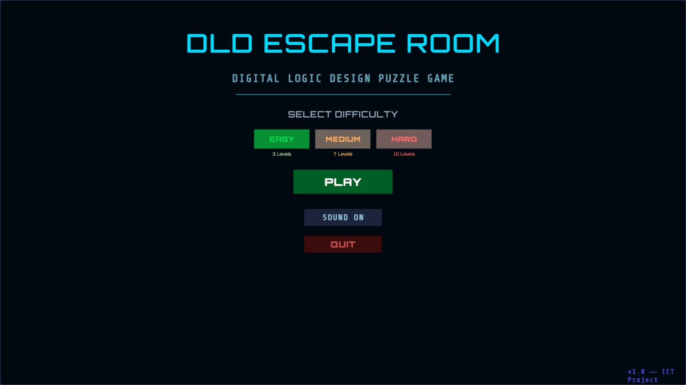
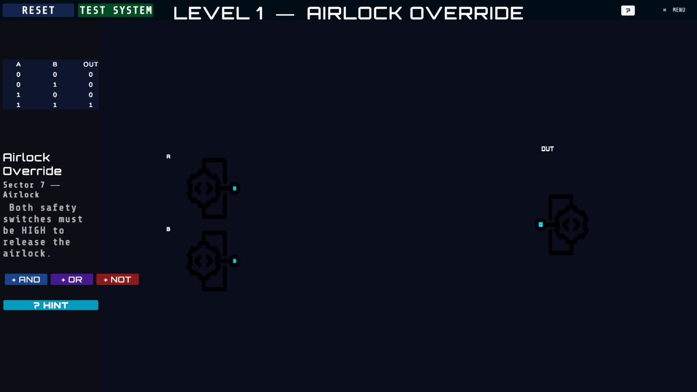
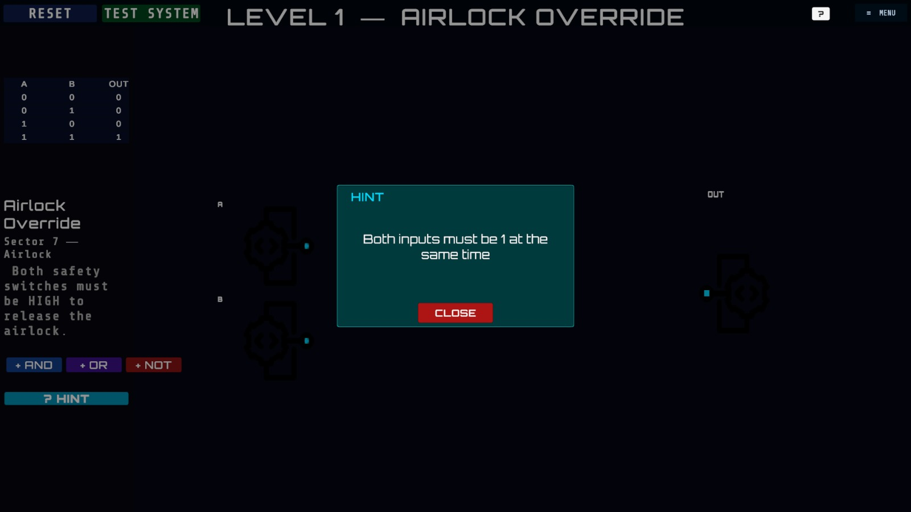
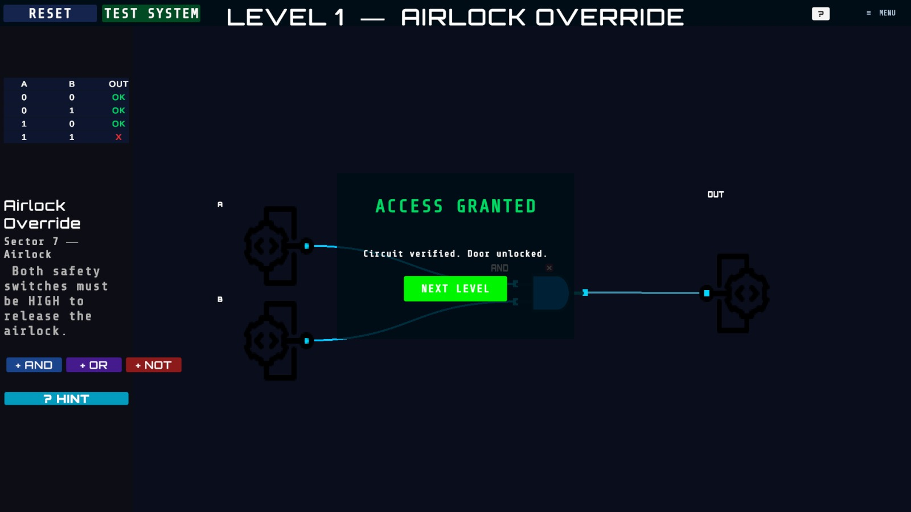
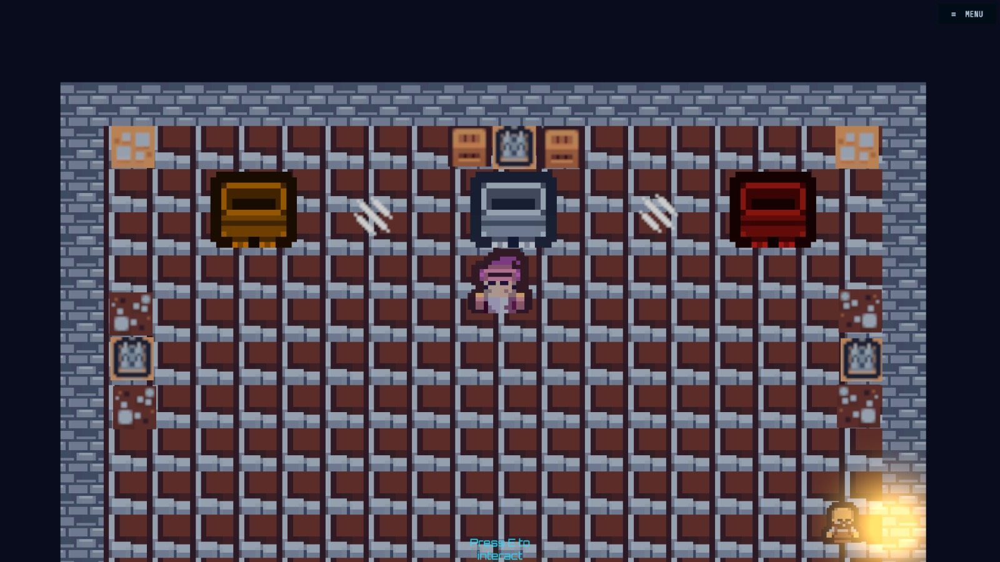
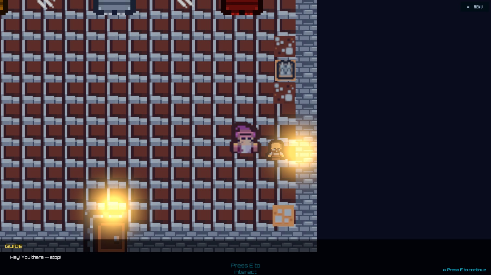

<div align="center">

# 🔌 DLD Escape Room

### *"Freedom Is Just One Circuit Away"*

**A 2D educational puzzle game where you solve real Digital Logic Design problems to escape a sci-fi facility**


[▶ Play on itch.io](https://ykk7.itch.io/logicdesign-escape-room) · [Screenshots](#-screenshots) · [Features](#-features) · [Levels](#%EF%B8%8F-levels) · [Source Code](https://github.com/YahyaKhan078/Escape_room_sourcecode)

</div>

---

## 🎮 About the Game

**DLD Escape Room** is a 2D educational puzzle game built in **Unity 6** as a university ICT project at GIK Institute. You are trapped inside a sci-fi facility. The only way out is to build working digital logic circuits.

Each room presents a puzzle: construct a circuit using AND, OR, NOT, XOR, and NAND gates that satisfies a given truth table. Solve all 10 levels and the exit door unlocks.

What makes it different from typical puzzle games: the circuit engine is **real**. It runs a genuine boolean logic simulation built from scratch in C# — students can solve each level in multiple valid ways, just like in actual circuit design.

> Built to bridge the gap between DLD classroom theory and hands-on learning. Curriculum-aligned with **FSc Pre-Engineering** and **A-Level Computer Science** DLD syllabi.

---

## 📸 Screenshots

| Main Menu | Puzzle Workspace |
|:---------:|:----------------:|
|  |  |

| Hint System | Access Granted |
|:-----------:|:--------------:|
|  |  |

| Exploration Map | Terminal Interaction |
|:---------------:|:--------------------:|
|  |  |

---

## ✨ Features

- **Custom Boolean Logic Engine** — Built from scratch in C#. Every gate is a live `Gate` object; `PropagateAll()` runs multi-pass chain resolution in real time
- **Drag & Drop Gate Workspace** — Place AND, OR, NOT, XOR, NAND gates freely. Connect them with Bezier-curve wires that color live (cyan = HIGH, dark = LOW)
- **Real-Time Truth Table Validator** — Live ✓/✗ feedback per row as you build — no submit button needed
- **10 Progressive Levels** — From a single AND gate to 4-input sum-of-products circuits
- **Three Difficulty Modes** — Easy (3 levels), Medium (6 levels), Hard (all 10)
- **Hint System** — Animated popup with blur overlay providing guided clues without giving away the answer
- **Exploration Map** — Top-down character movement between puzzle terminals with NPC story dialogue
- **Cinematic Level Intros** — Fade-in / slide-up level name reveal animations
- **Full Audio** — Sci-fi ambient tracks, wire-connect sounds, success/fail jingles
- **Gate Undo** — Ctrl+Z removes the last placed wire
- **Smooth Scene Transitions** — Fade coroutines managed by `SceneTransitionManager` across 3 Unity scenes

---

## 🗺️ Levels

| # | Name | Concept | Expression |
|:-:|------|---------|------------|
| 1 | Airlock Override | AND Gate | `A AND B` |
| 2 | Mainframe Reboot | XOR Gate | `A XOR B` |
| 3 | Vault Breaker | Combined Gates | `(A OR B) AND NOT C` |
| 4 | Signal Filter | Inhibit Gate | `A AND NOT B` |
| 5 | Dual Trigger | XNOR | `NOT(A XOR B)` |
| 6 | Triple Lock | 3-input AND | `A AND B AND C` |
| 7 | Majority Vote | Sum of Products | `(AB)+(BC)+(AC)` |
| 8 | NAND Challenge | Universal Gate | NAND gates only |
| 9 | Priority System | OR Gate | `A OR B` |
| 10 | Final Override | 4-input SOP | Exactly 2 of 4 inputs HIGH |

---

## 🏗️ Technical Architecture

The game runs across **3 Unity scenes** connected by persistent singletons:

```
MainMenu Scene
    ↓  Player selects difficulty
ExplorationMap Scene
    ↓  Player walks to terminal, presses E
SampleScene (Puzzle)
    ↓  Player completes all levels
ExplorationMap Scene
    ↓  Exit door unlocks
YOU ESCAPED → Back to MainMenu
```

**Key systems:**

- `GateLogic.cs` — Core boolean evaluator; gates stored with unique IDs, connected via a wire list
- `DifficultyManager` — Singleton with `DontDestroyOnLoad`; persists chosen difficulty across scenes
- `UILineRenderer` — Custom `Graphic`-subclassed wire renderer using Bezier curve math
- `SceneTransitionManager` — Fade coroutines for seamless scene changes
- `ScriptableObjects` — Level data (expected truth tables, gate constraints) stored as assets

> 📁 Full Unity source code: [Escape_room_sourcecode](https://github.com/YahyaKhan078/Escape_room_sourcecode)

---

## 🛠️ Tech Stack

| Tool | Purpose |
|------|---------|
| Unity 6 (2D) | Game Engine |
| C# | Game Logic & All Systems |
| TextMeshPro | UI Text Rendering |
| Kenney Tiny Dungeon | Tileset & Character Sprites |
| Freesound.org | Sound Effects & Music |
| Google Fonts — Orbitron, Share Tech Mono | Typography |
| Git + GitHub | Version Control |

---

## ▶️ Download & Play

**Option 1 — Play via itch.io (recommended)**

👉 [ykk7.itch.io/logicdesign-escape-room](https://ykk7.itch.io/logicdesign-escape-room)

**Option 2 — Direct download from GitHub Releases**

1. Go to the [Releases](../../releases) tab
2. Download `DLD_Escape_Room_v1.0.zip`
3. Extract the zip — keep all files in the same folder
4. Run `DLD_EscapeRoom.exe`

> ⚠️ Do not move `DLD_EscapeRoom.exe` out of the extracted folder. Unity games require the `_Data` folder and DLLs alongside the executable.

**System Requirements:** Windows 10/11 · 4 GB RAM · DirectX 11

---

## 🎮 How to Play

1. Select a difficulty from the main menu — Easy, Medium, or Hard
2. Walk your character to a terminal on the map and press **E**
3. In the puzzle workspace:
   - **Left-click** a gate in the sidebar to place it on the board
   - **Left-click** an output pin → **left-click** an input pin to draw a wire
   - Watch the **truth table** on the right — build until all rows show ✓
   - Press **TEST SYSTEM** to verify your full circuit
   - Press **HINT** if you are stuck
4. Complete all terminals → exit door unlocks → walk through to escape

---

## 🎬 Gameplay Video

[](https://www.youtube.com/watch?v=yLP8_3Ol_9g)

---

## 👥 Team

| Member | Role |
|--------|------|
| **Yahya Khalid** | Lead Developer · Game Logic · Scene Architecture |
| **Zeeshan Nasim** | UI Design · Level Design |
| **Muhammad Hamdoon** | Boolean Engine · Testing |
| **Abeer Ihsan** | Audio Integration · Visual Polish |

---

## 🔭 Roadmap (v2.0)

- [ ] Android mobile build
- [ ] Sprite walk animations via Unity Animator
- [ ] Additional levels covering flip-flops, multiplexers, and shift registers
- [ ] In-game leaderboard with best completion times
- [ ] Tutorial level for first-time players
- [ ] Multiplayer co-op wiring mode

---

## 📁 Related

| Link | Contents |
|------|----------|
| [itch.io page](https://ykk7.itch.io/logicdesign-escape-room) | Play or download — game page with screenshots & trailer |
| [dld-escape-room-pc](https://github.com/YahyaKhan078/dld-escape-room-pc) | Playable Windows build on GitHub |
| [Escape_room_sourcecode](https://github.com/YahyaKhan078/Escape_room_sourcecode) | Full Unity project source — Assets, Scripts, Scenes |
| [Gameplay Video](https://www.youtube.com/watch?v=yLP8_3Ol_9g) | YouTube walkthrough |

---

## 📄 License

This project is licensed under the MIT License. See [LICENSE](LICENSE) for details.

---

<div align="center">

**Built at GIK Institute · ICT Project · 2025**

*Yahya Khalid · Zeeshan Nasim · Muhammad Hamdoon · Abeer Ihsan*

</div>
